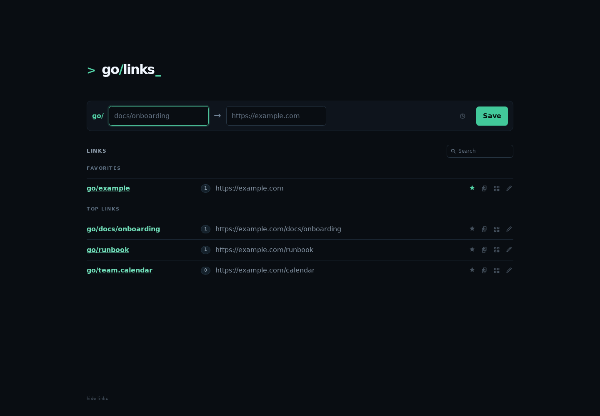
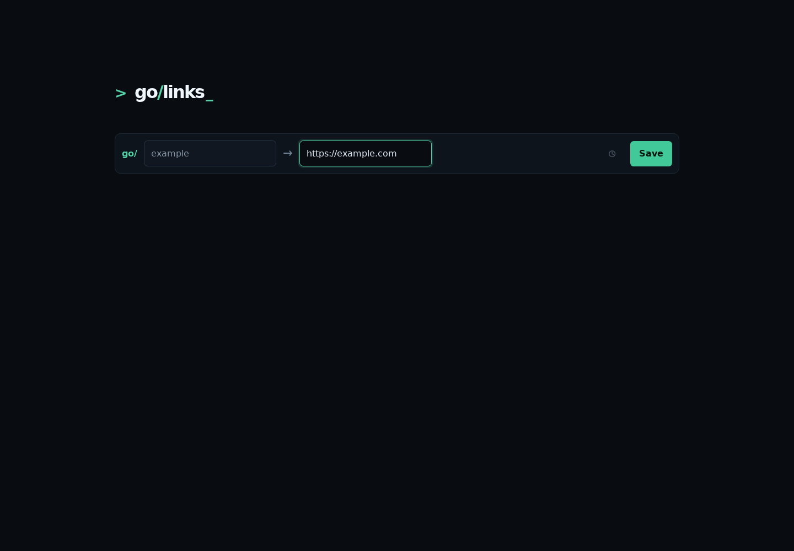

# go/links

A small self-hosted URL shortener for memorable internal links. It is built
for the kind of links a team, household, lab, or homelab reaches for all the
time, typed straight into the browser address bar:

- `go/picnic`
- `go/birthdayparty`
- `go/bookclub`
- `go/teamlunch`

The best version of go/links is boring in the nicest possible way: a tiny
always-on computer on your LAN, such as a Raspberry Pi, thin client, mini PC,
or spare Linux box, using the hostname `go`. Once it is running, anyone on the
network can type `go/<shortcut>` into the address bar instead of hunting
through bookmarks, chat history, admin portals, or wiki pages.

Most browsers, including Chrome, understand `go/picnic` as a local address
when `go` resolves on your LAN. Safari may need a trailing slash, such as
`go/picnic/`, if you want to skip typing `http://`.

## Why run it

- Makes internal links feel as quick as commands: type `go/shortcut` and go.
- Keeps private internal shortcuts inside your network.
- Runs without an external service, account, browser extension, or cloud
  dependency.
- Works well on low-power hardware that can sit quietly on a shelf.
- Uses one small SQLite database that is easy to back up and restore.
- Provides a simple web UI for creating and editing links.
- Supports nested shortcuts such as `go/events/picnic`.

## Why this go/links

There are plenty of go-links and URL-shortener projects. This one is for
people who want the smallest useful thing they can understand, run, and
recover without turning a shortcut service into a platform.

- LAN-first by design: it is meant to feel natural at `go/shortcut`, not just
  as another public short-link app.
- Simple to operate: one Go binary, one SQLite database, no external service,
  no queue, no cache, no frontend build chain.
- Good fit for tiny hardware: a Raspberry Pi, mini PC, thin client, VM, or
  spare Linux box is enough.
- Production-minded without being heavy: Debian `systemd` deployment, an
  unprivileged service user, port `80` binding without running as root, health
  checks, and scheduled local backups are already included.
- Easy to inspect and repair: links live in a local SQLite database, and the
  command-line tools cover backup, list, and maintenance deletion.
- Friendly for everyday users: the web UI focuses on creating, finding, using,
  and editing shortcuts instead of exposing a pile of administration screens.

## Run locally

```bash
./scripts/run-dev.sh
```

The server listens on `:8080` and stores links in `./data/golinks.db` by
default. Open `http://localhost:8080`, create a shortcut, then visit a path
such as `http://localhost:8080/docs/onboarding`.



Configuration is available through flags or environment variables:

```bash
go run ./cmd/golinks serve -addr :8080 -db ./data/golinks.db
GOLINKS_ADDR=:8080 GOLINKS_DB=./data/golinks.db go run ./cmd/golinks serve
```

Edit an existing shortcut at `/edit/<shortcut>`, or clicking on the pencil icon next to the shortcut in the list:



## Step-by-step HOWTO

This is the recommended home or small-office setup: install go/links on a
minimal Debian-family Linux machine, give that machine the hostname `go`, and
serve the app on port `80`.

### 1. Pick a small always-on host

Use a Raspberry Pi, mini PC, thin client, spare Linux box, or VM that can stay
powered on. Raspberry Pi OS, Debian, and Ubuntu are good targets.

Make sure it is on the same LAN as the people who will use the shortcuts.

### 2. Set the hostname to `go`

On the go/links host:

```bash
sudo hostnamectl set-hostname go
```

Reconnect to the machine if your shell prompt or SSH session still shows the
old name.

Many networks will now resolve the machine as `go.local` through mDNS. For the
shorter `http://go` address, also add a DNS entry or DHCP reservation in your
router that points the name `go` to this machine's LAN IP address. If your
router does not support local DNS names, add a hosts-file entry on each client
that needs to use it.

### 3. Install Go if needed

The Debian installer can install Go automatically when Go `1.24` or newer is
not already available. If you prefer to install Go yourself, install it before
the deploy step and confirm:

```bash
go version
```

### 4. Get the project onto the host

Clone or copy this repository onto the host:

```bash
git clone https://github.com/whiskeylover/golinks.git
cd golinks
```

If you copied a release archive instead of using Git, enter the extracted
project directory.

### 5. Deploy the service

On Debian, Raspberry Pi OS, or Ubuntu:

```bash
sudo ./scripts/deploy-debian.sh
```

The installer builds the app, creates an unprivileged `golinks` user, stores
the database at `/var/lib/golinks/golinks.db`, starts the service on port
`80`, enables it at boot, and enables daily local backups.

### 6. Check that it is healthy

From the go/links host:

```bash
curl http://localhost/healthz
systemctl status golinks
```

From another computer on the LAN:

```bash
curl http://go/healthz
```

If `http://go/healthz` does not work but `http://<server-ip>/healthz` does,
the service is running and only local name resolution needs attention.

### 7. Create your first shortcuts

Open `http://go` in a browser, add a shortcut such as:

- Shortcut: `picnic`
- Destination: a shared invite, map, signup sheet, or planning doc

Then visit:

```text
go/picnic
```

In most browsers, typing `go/picnic` in the address bar is enough. In Safari,
try `go/picnic/` if the browser searches instead of opening the link.

Add a few high-value links first: picnic plans, birthday party details, the
shared grocery list, school calendar, book club notes, team lunch signup, house
manual, wiki, docs, dashboards, and frequently used admin pages.

### 8. Back it up

The Debian deployment enables a daily backup timer that writes SQLite backups
to `/var/backups/golinks`. Check it with:

```bash
systemctl list-timers golinks-backup.timer
```

For a durable setup, periodically copy those backups to another machine, NAS,
or cloud bucket.

## Development script

`scripts/run-dev.sh` is a convenience wrapper for running the app from a
repository checkout on Linux or macOS:

```bash
GOLINKS_ADDR=:8081 GOLINKS_DB=./data/test.db ./scripts/run-dev.sh
```

## Use `go/shortcut`

The short hostname needs local network configuration outside the application:

1. Resolve `go` to the server through local DNS or a hosts-file entry.
2. Expose the service on port `80`, either directly with `-addr :80` or
   through a reverse proxy.

After that, the everyday usage is simply typing `go/<shortcut>` in the browser
address bar. Use `http://go/<shortcut>` when you want to be explicit, or add a
trailing slash in Safari if it treats the shortcut as a search.

## Deploy on Debian Linux

The Debian installer supports ARM64, ARMv6/ARMv7, and x64 systems using
`systemd`, including Raspberry Pi OS, Debian, and Ubuntu. It starts the app on
port `80`, enables it at boot, creates an unprivileged `golinks` user, and
stores the production database at `/var/lib/golinks/golinks.db`.

Copy or clone this repository onto the server and run:

```bash
sudo ./scripts/deploy-debian.sh
```

The command is safe to run again when deploying an updated version. If Go
`1.24` or newer is not already installed, the installer downloads a current
Go release from `go.dev`, verifies its checksum, and installs it before
building the binary.

Manage the installed `golinks.service` with the usual `systemctl` commands:

```bash
sudo systemctl start golinks
sudo systemctl stop golinks
sudo systemctl restart golinks
systemctl status golinks
journalctl -u golinks -f
curl http://localhost/healthz
```

The service runs as the unprivileged `golinks` user. Its `systemd` unit grants
only `CAP_NET_BIND_SERVICE`, which lets it bind to port `80` without running
the application as root.

## Deploy on macOS

The macOS installer builds the app, stores it under
`~/Library/Application Support/golinks`, and registers a user `launchd`
service that starts when you log in:

```bash
./scripts/deploy-macos.sh
```

It listens on `:8080` because an unprivileged macOS user service cannot bind
directly to port `80`. Use a local reverse proxy if the Mac needs to serve
`http://go` without a port number.

Inspect the service with:

```bash
launchctl print gui/$(id -u)/local.golinks.server
```

Rerun `./scripts/deploy-macos.sh` to rebuild and restart the macOS service.

## Back up the database

Create a consistent SQLite backup while the service is running:

```bash
go run ./cmd/golinks backup \
  -db ./data/golinks.db \
  -output ./backups/golinks-$(date +%F).db
```

Run that command from cron or a systemd timer and copy the resulting files to
another machine, NAS, or cloud bucket. A simple retention policy is 7 daily
and 4 weekly backups.

To restore a local development backup, stop the running development server
and replace its configured database file:

```bash
cp ./backups/golinks-2026-05-30.db ./data/golinks.db
```

Periodically verify a backup by opening it as a temporary database:

```bash
go run ./cmd/golinks serve -addr :8081 -db ./backups/golinks-2026-05-30.db
```

### Debian Linux production backup

The Debian installer enables a daily `systemd` timer:

```bash
systemctl list-timers golinks-backup.timer
systemctl status golinks-backup.timer
journalctl -u golinks-backup.service
```

The timer runs once per day around `03:15`, with a small randomized delay. If
the host is powered off at the scheduled time, `Persistent=true` makes systemd
run the missed backup after the host comes back online.

Backups are written to `/var/backups/golinks` as timestamped SQLite files.
After each successful scheduled backup, files older than 30 days are deleted
from that local backup directory. Trigger a backup immediately with:

```bash
sudo systemctl start golinks-backup.service
```

You can also create a consistent online backup manually while the service
remains running:

```bash
sudo /usr/local/bin/golinks backup \
  -db /var/lib/golinks/golinks.db \
  -output /var/backups/golinks/golinks-$(date +%F-%H%M%S).db
```

Copy the resulting files to another machine, NAS, or cloud bucket
periodically.

### Copy production backups to another host

For a NAS, homelab server, or other backup host, create the destination once.
If `/srv` requires elevated permissions, run:

```bash
ssh -t backup-host 'sudo mkdir -p /srv/backups/golinks && sudo chown $USER:$USER /srv/backups/golinks'
```

The local backup directory is owned by the `golinks` service user, so prefer
running the sync as that user instead of giving root a network SSH identity.
Create an SSH key for `golinks` and make sure it can SSH to the backup host
without prompting:

```bash
sudo install -d -m 0700 -o golinks -g golinks ~golinks/.ssh
sudo -u golinks ssh-keygen -t ed25519 -N '' -f ~golinks/.ssh/backup-host
sudo -u golinks ssh-copy-id -i ~golinks/.ssh/backup-host.pub backup-host
sudo -u golinks ssh -i ~golinks/.ssh/backup-host backup-host 'true'
```

Then add a cron job for the `golinks` user on the golinks host:

```cron
30 4 * * * rsync -a -e 'ssh -i ~golinks/.ssh/backup-host' --ignore-existing /var/backups/golinks/ backup-host:/srv/backups/golinks/
```

Install it into the `golinks` user's crontab without replacing existing cron
entries:

```bash
(sudo crontab -u golinks -l 2>/dev/null; echo "30 4 * * * rsync -a -e 'ssh -i ~golinks/.ssh/backup-host' --ignore-existing /var/backups/golinks/ backup-host:/srv/backups/golinks/") | sudo crontab -u golinks -
```

This copies any new local backup files to `backup-host` every day at `04:30`.
`--ignore-existing` avoids rewriting backups that were already copied.

If you prefer running cron as root or your login user, make sure that account
has read access to `/var/backups/golinks` and has its own non-interactive SSH
access to the backup host.

### Debian Linux production restore

Restoring replaces the live database, so stop the service first:

```bash
sudo systemctl stop golinks
sudo install -m 0600 -o golinks -g golinks \
  /var/backups/golinks/golinks-2026-05-31-120000.db \
  /var/lib/golinks/golinks.db
sudo systemctl start golinks
systemctl status golinks
curl http://localhost/healthz
curl --head http://localhost/your-shortcut
```

For the macOS user service:

```bash
"$HOME/Library/Application Support/golinks/bin/golinks" backup \
  -db "$HOME/Library/Application Support/golinks/golinks.db" \
  -output /path/to/backups/golinks-$(date +%F).db
```

## Delete a shortcut from the CLI

The web UI intentionally does not advertise shortcut deletion, but the hidden
confirmation page at `/delete/<shortcut>` is available when needed:


For maintenance tasks, including removing a malformed legacy shortcut, delete
an exact stored key with:

```bash
go run ./cmd/golinks list -db ./data/golinks.db

go run ./cmd/golinks delete \
  -db ./data/golinks.db \
  -shortcut 'legacy shortcut'
```

For the Debian Linux service, use `/usr/local/bin/golinks` and the production
database path:

```bash
sudo /usr/local/bin/golinks delete \
  -db /var/lib/golinks/golinks.db \
  -shortcut 'legacy shortcut'
```

## Roadmap

Keep future additions lightweight and focused on reducing friction or
improving reliability.

### Useful additions

- JSON or CSV import and export for migrations and disaster recovery.

### Shared-service features

- Optional descriptions or tags.
- An audit history for edits and deletions.
- Basic create, edit, and delete protection through a shared token or reverse
  proxy authentication.
